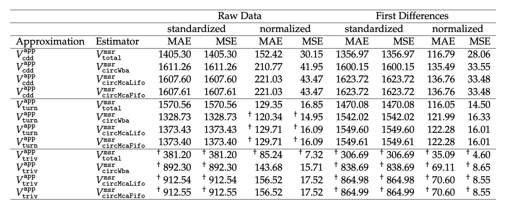

[](http://quantlet.de/)

## [](http://quantlet.de/) **catvom_2021_06_make_error_tables** [](http://quantlet.de/)

```yaml

Name of Quantlet: catvom_2021_06_make_error_tables

Published in: 'Cryptocurrencies and the Velocity of Money (Pernice et al., 2021)'

Description: 'Use the data from the Quantlet catvom_2021_05_make_error_data to make readable error tables.'

Keywords: performance measurement, error tables, bitcoin, velocity, pricing 

Author: Ingolf Pernice, Hermann Elendner, Georg Gentzen

See also: other Quantlets in this project

Submitted: 02.09.2023

Datafile: appVSest_summary.rda

Output: appVSest_errors_w_mcs.tex
```



### R Code
```r

##################################################################
### STEP 1 - SET PACKAGES & OPTIONS ### 
##################################################################
load_or_install_pkgs <- function(list_of_packages){
  
  new_packages <- list_of_packages[!(list_of_packages %in% installed.packages()[,"Package"])]
  if(length(new_packages)){
    install.packages(new_packages)
  } else {
    lapply(list_of_packages, require, character.only = TRUE)       
    # (Thanking: https://stackoverflow.com/questions/4090169/elegant-way-to-check-for-missing-packages-and-install-them)
  }
  print("That's done! I hope...")
}

##### Load packages ####
list_of_packages <- c("psych", "ggplot2", "reshape2", "stringr", 
                      "pageviews", "anytime", "dplyr", "tidyverse", "lubridate", 
                      "blockwatch", "stargazer", "corrplot", "tikzDevice", "vars",
                      "xtable", "MCS", "ggcorrplot", "car", "dplyr")
load_or_install_pkgs(list_of_packages)

options(scipen=999)
options("tikzLatex"="/usr/local/texlive/2023/bin/universal-darwin/latex")
#options("tikzLatex"="/usr/bin/pdflatex")
options(stringsAsFactors = FALSE)

n <- 20
#qual_col_pals = brewer.pal.info[brewer.pal.info$category == 'qual',]

btc_per_satoshi          <- 100000000
scaling_multiplicator    <- 1000000


##################################################################
### STEP 2 - SET SETTINGS OBJECT ### 
##################################################################

SETTINGS <- list()
SETTINGS$start_date              <- "2013-06-01"
SETTINGS$end_date                <- "2019-06-01"
SETTINGS$path_data               <- "./"
SETTINGS$blockwatch_refresh      <- FALSE #
SETTINGS$file                    <- "data.csv"
SETTINGS$path_tables             <- "./"
SETTINGS$path_figs               <- "./"
SETTINGS$stor_desc_filenames     <- c("descriptives_est_and_app.tex",
                                      "descriptives_nest_and_napp.tex",
                                      "descriptives_sest_and_sapp.tex",
                                      "descriptives_other.tex")
#SETTINGS$palette_1               <- unlist(mapply(brewer.pal,
#                                                  qual_col_pals$maxcolors,
#                                                  rownames(qual_col_pals)))
SETTINGS$palette_2               <- c("#999999", "#E69F00",
                                      "#56B4E9", "#009E73",
                                      "#F0E442", "#0072B2",
                                      "#D55E00", "#CC79A7")
SETTINGS$palette_3               <- c("#332288", "#88CCEE",
                                      "#44AA99", "#117733",
                                      "#999933", "#AA4499",
                                      "#DDCC77", "#882255")
SETTINGS$titles_for_plots        <- FALSE#TRUE #
SETTINGS$btc_per_satoshi         <- btc_per_satoshi
SETTINGS$scaling_multiplicator   <- scaling_multiplicator

##################################################################
### STEP 3 - HELPER FUNCTIONS: GENERAL ### 
##################################################################


add_sig_stars <- function(df
                          , tuples_1stars
                          , tuples_2stars
                          , tuples_3stars
                          , rowadd = 0
                          , coladd = 2
){
  
  for (r in 1:nrow(df)){
    for (c in 1:ncol(df)){
      if(paste0(r,"-",c) %in% tuples_1stars){df[r+rowadd,c+coladd] <- paste0(" \\(^{\\dag}\\) ",
                                                                             df[r+rowadd,c+coladd])} 
    }
  }
  
  for (r in 1:nrow(df)){
    for (c in 1:ncol(df)){
      if(paste0(r,"-",c) %in% tuples_2stars){df[r+rowadd,c+coladd] <- paste0(" \\(^{\\ddag}\\) ",
                                                                             df[r+rowadd,c+coladd])} 
    }
  }
  
  for (r in 1:nrow(df)){
    for (c in 1:ncol(df)){
      if(paste0(r,"-",c) %in% tuples_3stars){df[r+rowadd,c+coladd] <- paste0(" \\(^{\\ast}\\) ",
                                                                             df[r+rowadd,c+coladd])} 
    }
  }
  return(df)
}


add_sig_stars_automatic <- function(vec,
                                    sigLevs = c(0.10, 0.05, 0.01)
){
  
  vec_num   <- suppressWarnings(as.numeric(vec))
  vec_char  <- vec
  vec_char[is.na(vec_num )] <- "\\( - \\)"
  for(sigLev in sigLevs){
    for(i in 1:length(vec)){
      
      if(!is.na(vec_num[i]) && vec_num[i] < sigLev){
        vec_char[i] <- paste0(vec_char[i], "\\(^{\\ast} \\)")
      }
      
    }
  }
  return(vec_char)
}

splitrownames <- function(rnames, by = " VS "){
  rnames_split <- strsplit(x=rnames, " VS ")    
  rnames_1 <- as.character(unlist(lapply(rnames_split, function(x){x[[1]]})))
  rnames_2 <- as.character(unlist(lapply(rnames_split, function(x){x[[2]]})))
  res <- list(rnames_1, rnames_2)
  names(res) <- c("left_from_BY", "right_from_BY")
  return(res)
}
##################################################################
### STEP 4 - HELPER FUNCTIONS: SPECIFIC HELPER FUNCTIONS ### 
##################################################################


##################################################################
### STEP 5 - LOAD INPUT DATA ### 
##################################################################
setwd("/Users/ingolfpernice/Documents/catvom_2021/catvom_2021_06_make_error_tables/")
load(file = paste0(SETTINGS$path_data, "appVSest_summary.rda"))

##################################################################
### STEP 6 - SCRIPT ### 
##################################################################

#########################################################
## Build a joined summary
summary <- cbind(
    summary_dta[["mae_stand_ts"]],
    summary_dta[["mae_stand_ts"]],
    summary_dta[["mae_norm_ts"]],
    summary_dta[["mse_norm_ts"]],
    summary_dta[["mae_stand_ts_d1"]],
    summary_dta[["mae_stand_ts_d1"]],
    summary_dta[["mae_norm_ts_d1"]],
    summary_dta[["mse_norm_ts_d1"]])
                                        # save colnames and rownames
cnames <- rep(c("MAE","MSE","MAE","MSE"), 2)
rnames <- rownames(summary)
                                        # round dataframe and convert to char.
summary <- format(round(summary, digits = 2), nsmall = 2)
summary <- sapply(summary, as.character)
                                        # use saved colnames and rownames
rownames(summary) <- rnames
colnames(summary) <- cnames

#########################################################
## Make rownames to 2 columns in the beginning
summary <- cbind(data.frame(Approximation = splitrownames(rnames = rownames(summary),
                                                          by = " VS ")[["left_from_BY"]],
                            Estimator = splitrownames(rnames = rownames(summary),
                                                      by = " VS ")[["right_from_BY"]]),
                 summary)


#########################################################
## Add columns as row for custom column header
cnames  <- as.character(rbind(colnames(summary)))
summary <- rbind(cnames, summary)

#########################################################
#Add places for significance stars
sig_tuples_1 <- c("10-1","11-1","12-1","13-1",
                  "10-2","11-2","12-2","13-2",
                  "7-3","8-3","9-3","10-3",
                  "7-4","8-4","9-4","10-4",
                  "10-5","11-5","12-5","13-5",
                  "10-6","11-6","12-6","13-6",
                  "10-7","11-7","12-7","13-7",
                  "10-8","11-8","12-8","13-8")


summary <- add_sig_stars(df = summary,
                         tuples_1stars = sig_tuples_1,
                         tuples_2stars = NULL,
                         tuples_3stars = NULL)

#########################################################
## Add Multicolumn row
addtorow <- list()
addtorow$pos <- list(0)
addrow1 <-"\\hline \\multicolumn{2}{l}{ } & \\multicolumn{4}{c}{Raw Data} & \\multicolumn{4}{c}{First Differences} \\\\"
addrow2 <- "\\hline \\multicolumn{2}{l}{ } & \\multicolumn{2}{c}{standardized} & \\multicolumn{2}{c}{normalized} & \\multicolumn{2}{c}{standardized} & \\multicolumn{2}{c}{normalized} \\\\"
addtorow$command <- paste0(addrow1, addrow2)

#########################################################
## Finally print latex table
subtable_latex        <- xtable(summary,
                                align = "lllrrrrrrrr")
print(subtable_latex
    , file=paste0(SETTINGS$path_tables, "appVSest_errors_w_mcs.tex")
    , sanitize.text.function = function(x) x
    , floating = FALSE
    , include.rownames=FALSE
    , add.to.row=addtorow
    , include.colnames=FALSE,
    , hline.after = c(0, 1, 5, 9, nrow(summary)))

```

automatically created on 2023-09-21